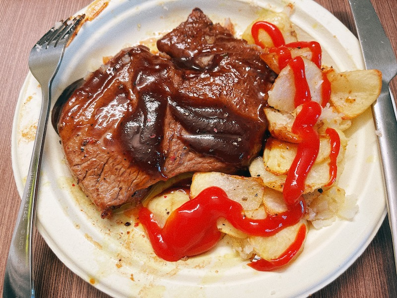

# Pan Fry Steak 煎牛排
> 平底锅煎或煎是一种油炸食品形式，其特点是使用最少的食用油或脂肪（与浅煎或油炸相比），通常仅使用足以润滑平底锅。 对于培根等油腻食物，可能不需要添加油或脂肪。作为一种油炸形式，该技术依赖于油或脂肪作为传热介质，以及正确的温度和时间，以免过度烹饪或燃烧食物。煎炸可以保持肉类和海鲜等食物中的水分。食物通常至少翻转一次，以确保两面都煮熟。([Wikipedia](https://en.wikipedia.org/wiki/Pan_frying))
## 原料和工具
- 牛排
- 黑胡椒海盐
- 橄榄油
- 黄油
- 蒜
- 其他香料
- Steak Sauce (Optional)

## 操作
- 牛排用厨房纸，擦干两面的水分，每面洒点椒盐和香料，刷橄榄油腌制一小会
- 锅中烧干水分，加入橄榄油，下牛排，蒜瓣可以来一点，每面煎2分钟。
- 下黄油一小块，牛排两面翻着吸一下黄油后盛出来
- 醒肉，把牛排切成小条醒一会
- 加入 Steak Sauce
- 摆盘
## Tips
- 可以烤点土豆佐餐
## Instance
摄于 *UofA, Alberta, Canada, 2022/08/15*

