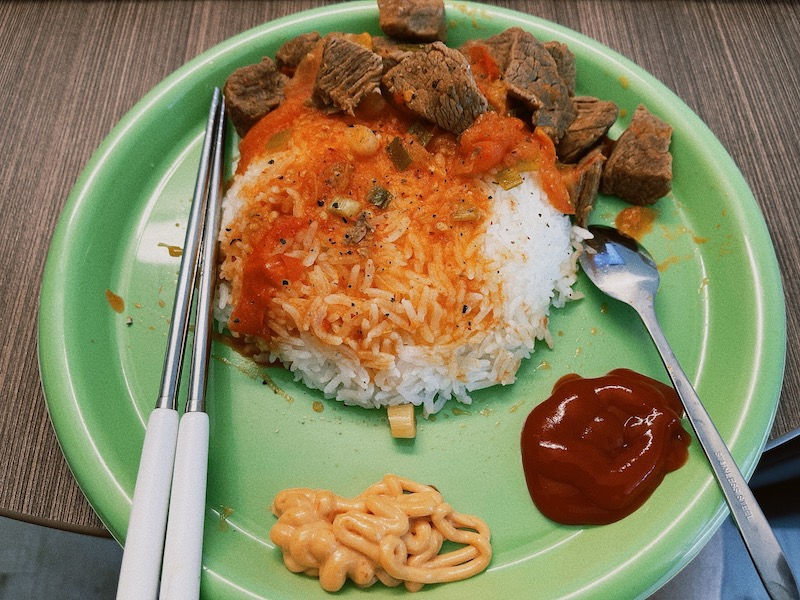

# Tomato Beef 番茄牛肉
> 番茄牛肉是东北的传统名菜，属于东北菜系。此菜汁浓味香。酸甜可口。既有蛋白质又有维生素。做法实在简单。放在饭上，分外赏心悦目。勾起食欲。
主要原料是牛肉、西红柿，口味是咸鲜，工艺是烧、炖。火候很有考究。

## 原料和工具
- 牛肉小块
- 番茄
- 葱
- 黄油、橄榄油
- 生姜
- 料酒、酱油、盐

## 操作
- 牛肉用水洗干净，加入葱、生姜、盐、料酒、香料腌制半小时
- 锅中加入黄油和橄榄油，将牛肉放进去煎
- 煎五分钟后加入适量水、番茄、生姜、酱油炖十分钟
- 加入葱，并炖至收汁
- 摆盘，加香料

## Tips
- 可以加入适量番茄酱
- 汁水多一些更适合盖浇饭

## Instance
摄于 *UofA, Alberta, Canada, 2022/08/17*

