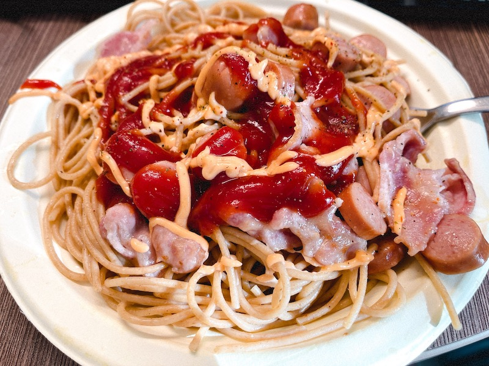

# Spaghetti 意大利面
> 意大利面是一种又长又薄的实心圆柱形意大利面。它是意大利传统美食的主食。像其他意大利面一样，意大利面由碾碎的小麦和水制成，有时还富含维生素和矿物质。意大利面条通常由硬质小麦粗面粉制成。([Wikipedia](https://en.wikipedia.org/wiki/Spaghetti))

## 原料和工具
- 意大利面
- 黄油
- 盐（如果用的是 salted butter 则省去）
- 芝士
- 培根，香肠，午餐肉等肉类

## 操作
- 将锅中水烧开后加入适量意大利面后煮 10 分钟后（这一步可以稍微加一点盐）捞出放入冷水中备用。
- 锅内水干后加入适量黄油后放入培根香肠等肉类炒熟
- 加入适量水，同时加入芝士和盐（这一注意不要糊锅）
- 将冷水中的面捞起放入锅内
- 收汁到一定程度后全部捞起到盘子中
- 加入适量番茄酱，沙拉酱，香料等

## Tips
黄油，芝士等原料的量因人而异

## Instance
摄于 *UofA, Alberta, Canada, 2022/08/15*

