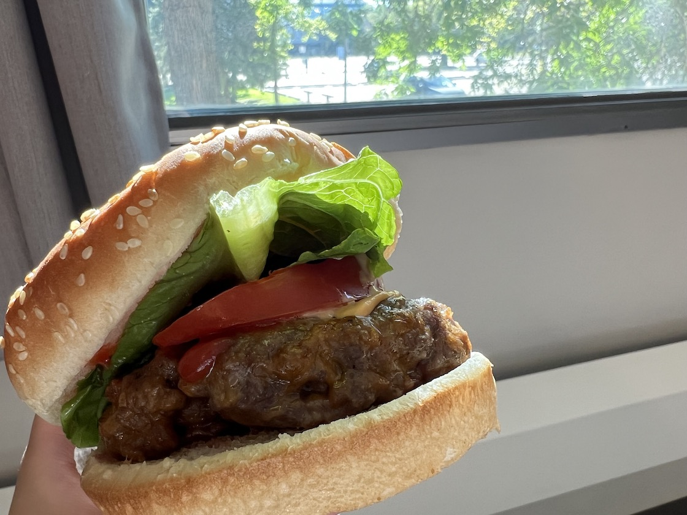

# Hamurger 汉堡
> 汉堡包（简称汉堡）是一种由馅料组成的食物--通常是由碎肉组成的肉饼，通常是牛肉，放在切片的面包或面包卷内。汉堡包通常与奶酪、生菜、西红柿、洋葱、泡菜、培根或辣椒；番茄酱、芥末酱、蛋黄酱、调味品或 "特殊酱料"（通常是千岛酱的一种变体）等调味品一起食用；并经常放在芝麻面包上。浇上奶酪的汉堡包被称为奶酪汉堡。([Wikipedia](https://en.wikipedia.org/wiki/Hamburger))

## 原料和工具
- 肉饼（超市可以买到，包括内含洋葱的芝士肉饼）
- 橄榄油
- 汉堡面包片
- 生菜
- 番茄
- 番茄酱，沙拉酱，BBQ 酱等酱料

## 操作
- 预热烤箱到 400 华氏度后，肉饼刷橄榄油后放入烤箱，烤 6 分钟后翻面再烤 4 分钟
- 切一片生菜，一些番茄片（还可以加入酸黄瓜，我不喜欢吃酸黄瓜就没加）
- 组合，挤酱汁在肉饼和蔬菜上

## Tips
- 肉饼不要烤的太干，不 juicy
- 酱料看个人喜好

## Instance
摄于 *UofA, Alberta, Canada, 2022/08/14*

